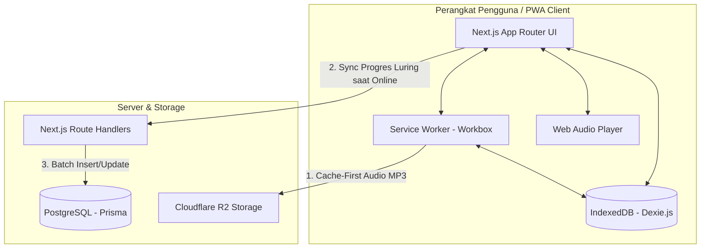

# DengarBain — Web Accessibility Platform for Blind Users 📖🎧

<p align="center">
  
  
  
  
  
  
</p>

> **DengarBain** adalah Progressive Web App (PWA) inklusif yang dirancang khusus untuk memfasilitasi santri dan pengguna tunanetra dalam mengakses, mendengarkan, serta menghafal **40 Hadis Arbain An-Nawawiyah** secara mandiri. Aplikasi ini menggabungkan antarmuka non-visual ramah *Screen Reader*, mesin pengulangan audio (*A-B Looping*), dan arsitektur *Offline-First* tanpa hambatan otentikasi (*No-Login / Frictionless*).

---

## 🚧 Status Proyek & Demo

> **Status:** `In Active Development` 🛠️  
> Proyek ini sedang dalam tahap pengembangan aktif, pengujian aksesibilitas (*screen reader*), dan persiapan *deployment*. Tautan *live demo* serta dokumentasi visual (*screenshots* & demo suara) akan dipublikasikan setelah tahap rilis produksi selesai.

---

## 🎯 Problem Statement
1. **Keterbatasan Media Belajar Khusus**: Mushaf atau kitab hadis berhuruf Braille memiliki ketersediaan fisik yang sangat terbatas dan biaya produksi yang tinggi.
2. **Hambatan Aksesibilitas Digital**: Sebagian besar aplikasi Islam modern berfokus pada estetika visual dan mengabaikan pembaca layar (*TalkBack* / *VoiceOver*), sehingga menghasilkan pengalaman yang membingungkan bagi tunanetra (banyak tombol tanpa label, urutan fokus tidak teratur).
3. **Ketergantungan Internet**: Akses internet di lingkungan pondok pesantren sering kali tidak stabil, sedangkan aplikasi berbasis *streaming* audio konvensional terhenti saat jaringan terputus.
4. **Friksi Otentikasi**: Form *login*, *captcha*, dan verifikasi OTP menjadi rintangan aksesibilitas yang berat bagi pengguna tunanetra.

## 💡 The Solution
DengarBain dibangun dari nol dengan paradigma **A11y-First (Accessibility-First)** dan **Offline-First**:
- **100% Screen Reader Optimized**: Setiap elemen struktural menggunakan Semantic HTML5 dan atribut WAI-ARIA yang terkalibrasi untuk navigasi gestur *swipe*.
- **Offline-First Audio & PWA**: Seluruh berkas aplikasi dan audio Hadis tersimpan di *cache* lokal sehingga dapat diakses penuh di daerah tanpa sinyal.
- **Frictionless Experience**: Tidak ada form registrasi atau *login*. Identitas dan riwayat progres belajar diikat secara anonim ke perangkat lokal (*Device UUID*).

## 👤 Target User
- **Santri Tunanetra**: Membutuhkan media audio berulang untuk memperkuat hafalan (*tahfidz*) Hadis Arbain.
- **Tunanetra Mandiri**: Pengguna disabilitas netra yang ingin mempelajari terjemahan dan kandungan hadis tanpa bantuan orang awas (*sighted guide*).
- **Pengajar / Pembina Pesantren**: Memantau progres belajar santri secara luring.

---

## 🛠️ Deep Dive: Tech Stack & Justifikasi Teknikal

Berikut adalah rincian teknologi yang digunakan dan alasan teknikal di balik pemilihannya:

| Lapisan / Komponen | Teknologi yang Digunakan | Justifikasi Teknikal & Rekayasa |
| :--- | :--- | :--- |
| **Frontend Framework** | **Next.js 14+ / 15 (App Router)** | Menyediakan *Static Site Generation* (SSG) untuk memproduksi *bundle* HTML statis yang dapat dimuat seketika (*instant-load*) dan sangat ramah *Service Worker*. |
| **Bahasa Pemrograman** | **TypeScript 5.x** | Menjamin keamanan tipe data (*Type Safety*), mencegah *runtime error*, dan mempermudah pemodelan data teks hadis, transliterasi, serta status hafalan. |
| **UI Primitives & A11y** | **Radix UI Primitives** | Merender komponen interaktif tak berstilisasi yang membawa kepatuhan WAI-ARIA bawaan, manajemen fokus kursor otomatis (*focus trapping*), dan dukungan navigasi keyboard penuh. |
| **Styling Engine** | **Tailwind CSS & CSS Variables** | Memungkinkan penyusunan tema *High-Contrast* (skema warna hijau tua `#1A5C40` dan latar netral `#F4F3EE`), serta utilitas pembaca layar khusus (`sr-only`) untuk label tak terlihat. |
| **PWA & Offline Core** | **Workbox (Service Worker)** | Mengelola *Precaching* aset aplikasi dan strategi *Cache-First* untuk file audio MP3 Hadis, memungkinkan pemutaran audio lancar tanpa kuota internet. |
| **Penyimpanan Lokal (Client)** | **IndexedDB / Dexie.js (`lib/db.ts`)** | Menyimpan status progres 40 hadis (`hafal`, `sedang`, `belum`), stempel waktu terakhir didengarkan, dan titik pengulangan *A-B Loop* langsung di peramban pengguna. |
| **Audio Engine** | **Web Audio API & HTML5 Audio** | Mengendalikan *playback* audio presisi tinggi, penghitungan akumulasi detik belajar, dan pemutaran ulang segmen tertentu (*A-B Looping*) tanpa *glitch*. |
| **Backend & ORM (Sync)** | **Next.js Route Handlers & Prisma ORM** | Endpoint API ringan untuk menangani sinkronisasi data analitik progres latar belakang (*Background Sync*) dari perangkat lokal. |
| **Database Server** | **PostgreSQL** | *Database* relasional untuk menampung data agregasi progres hafalan berbasis *Device UUID* anonim. |
| **Audio Storage & CDN** | **Cloudflare R2 + Cloudflare CDN** | Penyimpanan objek audio Hadis dengan biaya *bandwidth egress* $0, memastikan pengiriman audio berkecepatan tinggi ke seluruh jaringan. |

---

## ♿ Rekayasa Aksesibilitas (A11y Engineering)

DengarBain tidak hanya memenuhi standar aksesibilitas dasar, tetapi secara khusus dikalibrasi untuk perilaku mesin pembaca layar:

1. **Aksen & Pengucapan Tajwid (`lang="ar"` & `dir="rtl"`)**
   - Teks Arab pada matan hadis dibungkus secara eksplisit dengan `<p lang="ar" dir="rtl">`. Hal ini memaksa mesin sintetis suara (*Text-to-Speech*) TalkBack/VoiceOver beralih ke aksen bahasa Arab dan melafalkan harakat serta tajwid dengan presisi tinggi, alih-alih mengejanya dengan aksen Indonesia.
2. **Penandaan Bahasa Indonesia (`lang="id"`)**
   - Terjemahan dan transliterasi ditandai dengan `lang="id"` agar suara pembaca layar kembali ke fonetik bahasa Indonesia yang alami.
3. **Live Regions (`aria-live="polite"`)**
   - Status perubahan aplikasi (misalnya: `"Mode pengulangan audio diaktifkan"`) diumumkan langsung ke telinga pengguna tanpa memindahkan fokus kursor saat ini.
4. **Accessible Audio Controls & Sliders**
   - Kontrol pemutar audio menyertakan atribut ARIA lengkap (`role="slider"`, `aria-valuenow`, `aria-valuemin`, `aria-valuemax`, `aria-label`) sehingga pengguna mengetahui persentase pemutaran hadis yang sedang berjalan.
5. **Navigasi Gestur Usapan Penuh (*Swipe Gestures*)**
   - Setiap kartu hadis dan navigasi bawah (`BottomNav`) didesain dengan hierarki semantik yang membuat pengguna cukup mengusap layar ke kanan/kiri (*swipe right/left*) untuk berpindah menu.

📚 *Baca studi kasus selengkapnya di [Accessibility Case Study](docs/accessibility.md).*

---

## 🏗️ Arsitektur Sistem & Alur Data (Offline-First)



### Siklus Alur Data:
1. **Pemuatan Pertama (*First Load*)**: Service Worker mengunduh seluruh *bundle* HTML, CSS, dan skrip aplikasi ke *Cache Storage*.
2. **Pemutaran Audio**: Saat audio hadis diputar, Service Worker memeriksa *cache*. Jika file MP3 belum ada, sistem mengunduhnya dari CDN Cloudflare R2, memutarnya, dan menyimpannya di *cache* lokal.
3. **Penyimpanan Status Belajar**: Setiap detik mendengarkan dan perubahan status hadis disimpan ke *IndexedDB* secara instan tanpa menunggu respons jaringan.
4. **Sinkronisasi Latar Belakang**: Saat koneksi internet terdeteksi (`navigator.onLine`), sistem secara otomatis mengirimkan pembaruan data anonim ke *server*.

📚 *Baca rincian arsitektur teknis di [Architecture Document](docs/architecture.md).*

---

## ✨ Fitur-Fitur Utama

- 📖 **40 Hadis Arbain An-Nawawiyah Lengkap**: Dilengkapi matan Arab berharakat, transliterasi latin, terjemahan bahasa Indonesia, dan riwayat perawi.
- 🔁 **A-B Looping Hafalan**: Memungkinkan santri menentukan rentang pengulangan audio untuk mempermudah talaqqi dan hafalan mandiri.
- 📊 **Tracker Progres Belajar**: Melacak jumlah hadis yang telah dihafal (*Hafal, Sedang, Belum*) serta akumulasi waktu belajar harian.
- 📶 **100% Operasional Luring**: Bekerja penuh di mode pesawat (*Airplane Mode*) atau area tanpa koneksi seluler.
- 📱 **Installable PWA**: Dapat dipasang ke layar utama (*Home Screen*) perangkat Android, iOS, maupun desktop dengan ikon mandiri.

---

## 👨‍💻 Kontribusi Tim Pengembang

Proyek ini dirancang dan dibangun melalui kolaborasi terfokus antara dua pengembang:

**[Irsal Shydiq](https://github.com/Irs622)** — *Project Manager, Backend & PWA Developer, UI/UX*
- **Product Management & UI/UX**: Memimpin inisiasi konsep produk, riset kebutuhan santri tunanetra, dan perancangan alur interaksi non-visual.
- **Backend & Database**: Merancang arsitektur API, skema PostgreSQL menggunakan Prisma ORM, dan mekanisme *Background Synchronization*.
- **PWA & Offline Core**: Mengimplementasikan *Service Worker* (Workbox), strategi penyimpanan *Cache-First*, dan integrasi IndexedDB (Dexie.js).

**[Fardho Dzurrahman](https://github.com/fardhoz25)** — *Frontend Developer & UI/UX*
- **Frontend & Audio Engine**: Mengembangkan antarmuka responsif berbasis Next.js App Router, integrasi pemutar audio (*A-B Looping*), dan penataan gaya Tailwind CSS.
- **Accessible UI/UX**: Mengembangkan komponen interaktif (Radix UI) yang ramah terhadap navigasi gestur *TalkBack* (Android) & *VoiceOver* (iOS).

---

## 🚀 Panduan Menjalankan di Lokal (Local Setup)

### Prasyarat Sistem
- **Node.js**: Versi `18.17.0` atau lebih baru
- **npm**: Versi `9.0.0` atau lebih baru
- **Git**

### Langkah Instalasi:

1. **Clone Repositori:**
   ```bash
   git clone https://github.com/Irs622/dengarbainweb.git
   cd dengarbainweb
   ```

2. **Pasang Dependensi:**
   ```bash
   npm install
   ```

3. **Konfigurasi Lingkungan (*Environment Variables*):**
   Salin file template `.env.example` menjadi `.env.local`:
   ```bash
   cp .env.example .env.local
   ```
   Sesuaikan variabel konfigurasi (URL Database & Cloudflare R2) jika ingin menghubungkan ke backend.

4. **Jalankan Development Server:**
   ```bash
   npm run dev
   ```
   Aplikasi akan berjalan di [http://localhost:3000](http://localhost:3000).

5. **Pengujian Build Produksi:**
   ```bash
   npm run build
   npm run start
   ```

---

## 🧪 Panduan Pengujian Aksesibilitas

Untuk menguji fitur aksesibilitas DengarBain secara mandiri:
1. **Navigasi Keyboard**: Buka aplikasi dan navigasikan seluruh halaman menggunakan tombol `Tab`, `Shift+Tab`, `Space`, `Enter`, dan tombol panah tanpa menyentuh *mouse*.
2. **Pengujian Screen Reader**:
   - **macOS / iOS**: Aktifkan **VoiceOver** (`Cmd + F5` di Mac atau via Pengaturan Aksesibilitas di iOS).
   - **Android**: Aktifkan **TalkBack** di Pengaturan Aksesibilitas.
   - **Windows**: Gunakan **NVDA** atau **JAWS**.
3. **Audit Lighthouse**: Buka Chrome DevTools (`F12`), masuk ke tab *Lighthouse*, centang kategori *Accessibility*, dan jalankan audit untuk melihat skor kepatuhan 100/100.

📚 *Baca panduan metodologi pengujian di [Testing Methodology](docs/testing.md).*

---

## 🤝 Kontribusi & Komunitas
Kami sangat menyambut partisipasi dan kontribusi dari komunitas pengembang:
- Silakan baca panduan lengkap cara berkontribusi di [CONTRIBUTING.md](CONTRIBUTING.md).
- Harap patuhi kode etik komunitas di [CODE_OF_CONDUCT.md](CODE_OF_CONDUCT.md).

---

## 📄 Lisensi
Proyek ini dilisensikan di bawah **MIT License** - lihat file [LICENSE](LICENSE) untuk detail hak cipta lengkap.
