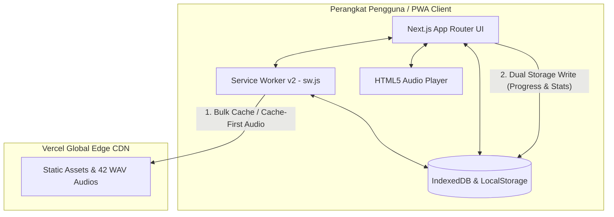

# DengarBain — Web Accessibility Platform for Blind Users 📖🎧

<p align="center">
  
  
  
  
  
  
  
</p>

> **DengarBain** adalah Progressive Web App (PWA) inklusif yang dirancang khusus untuk memfasilitasi santri dan pengguna tunanetra dalam mengakses, mendengarkan, serta menghafal **42 Hadis Arbain An-Nawawiyah** secara mandiri. Aplikasi ini menggabungkan antarmuka non-visual ramah *Screen Reader*, pemutar audio responsif berkecepatan dinamis, paket unduh luring 1-klik (*Bulk Offline Cache*), dan arsitektur *Offline-First* tanpa hambatan otentikasi (*No-Login / Frictionless*).

---

## 🌐 Live Production Demo

* **Live Web App**: [https://production-eight-mu.vercel.app](https://production-eight-mu.vercel.app)
* **Production Branch**: [`production`](https://github.com/Irs622/dengarbainweb/tree/production)
* **Main Branch**: [`main`](https://github.com/Irs622/dengarbainweb/tree/main)

---

## 🎯 Problem Statement
1. **Keterbatasan Media Belajar Khusus**: Mushaf atau kitab hadis berhuruf Braille memiliki ketersediaan fisik yang sangat terbatas dan biaya produksi yang tinggi.
2. **Hambatan Aksesibilitas Digital**: Sebagian besar aplikasi Islam modern berfokus pada estetika visual dan mengabaikan pembaca layar (*TalkBack* / *VoiceOver*), sehingga menghasilkan pengalaman yang membingungkan bagi tunanetra (banyak tombol tanpa label, urutan fokus tidak teratur).
3. **Ketergantungan Internet**: Akses internet di lingkungan pondok pesantren sering kali tidak stabil, sedangkan aplikasi berbasis *streaming* audio konvensional terhenti saat jaringan terputus.
4. **Friksi Otentikasi**: Form *login*, *captcha*, dan verifikasi OTP menjadi rintangan aksesibilitas yang berat bagi pengguna tunanetra.

## 💡 The Solution
DengarBain dibangun dari nol dengan paradigma **A11y-First (Accessibility-First)** dan **Offline-First**:
- **100% Screen Reader Optimized**: Setiap elemen struktural menggunakan Semantic HTML5 dan atribut WAI-ARIA yang terkalibrasi untuk navigasi gestur *swipe* dan pembaca layar.
- **Offline-First Audio & PWA**: Seluruh berkas aplikasi dan 42 rekaman audio Hadis berformat `.wav` dapat diunduh dalam 1-klik dan tersimpan di *Cache Storage* lokal untuk pemutaran tanpa kuota data.
- **Frictionless Experience**: Tidak ada form registrasi atau *login*. Identitas dan riwayat progres belajar diikat secara anonim ke perangkat lokal (*Device UUID*).
- **Dual Local Storage**: Sinkronisasi dua arah instan antara `IndexedDB` dan `LocalStorage` untuk menjamin keamanan data progres belajar, streak harian, dan riwayat aktivitas.

## 👤 Target User
- **Santri Tunanetra**: Membutuhkan media audio berulang dan kontrol kecepatan putar untuk memperkuat hafalan (*tahfidz*) 42 Hadis Arbain.
- **Tunanetra Mandiri**: Pengguna disabilitas netra yang ingin mempelajari terjemahan, kosakata pilihan (*kata-kata pilihan*), urgensi hadis, dan konteks sebab turun hadis tanpa bantuan orang awas (*sighted guide*).
- **Pengajar / Pembina Pesantren**: Memantau progres belajar santri secara luring.

---

## 🛠️ Deep Dive: Tech Stack & Justifikasi Teknikal

Berikut adalah rincian teknologi yang digunakan dan alasan teknikal di balik pemilihannya:

| Lapisan / Komponen | Teknologi yang Digunakan | Justifikasi Teknikal & Rekayasa |
| :--- | :--- | :--- |
| **Frontend Framework** | **Next.js 15 (App Router)** | Menyediakan *Static Site Generation* (SSG) untuk memproduksi *bundle* HTML statis (57 halaman) yang dimuat seketika (*instant-load*) dan terintegrasi dengan *Service Worker*. |
| **Bahasa Pemrograman** | **TypeScript 5.x** | Menjamin keamanan tipe data (*Type Safety*), mencegah *runtime error*, dan memodelkan data 42 hadis, kosakata pilihan, urgensi, dan status hafalan. |
| **Styling & Theme** | **Vanilla CSS + CSS Variables** | Tema berestetika tinggi dengan palet warna hijau tua `#1A5C40`, aksen `#C8F1DF`, latar netral `#F4F3EE`, serta utilitas pembaca layar khusus (`sr-only`) untuk label suara tak terlihat. |
| **PWA & Offline Core** | **Service Worker (`public/sw.js`)** | Cache v2 (`dengarbain-cache-v2`) dengan strategi *Cache-First* untuk 42 berkas audio `.wav`, *Pre-caching* rute utama, dan *Stale-While-Revalidate* untuk aset statis. |
| **Penyimpanan Lokal (Client)** | **IndexedDB & LocalStorage (`lib/db.ts`)** | *Dual-Storage Helper* untuk menyimpan status 42 hadis (`hafal`, `sedang`, `belum`), stempel waktu belajar, streak harian, dan 15 riwayat aktivitas terbaru. |
| **Audio Engine** | **HTML5 Audio & Web APIs** | Mengendalikan pemutaran 42 berkas audio `.wav`, tombol lompat mundur 10 detik, maju 10 detik, restart awal, dan pengatur kecepatan (0.75x, 1.0x, 1.25x, 1.5x). |
| **Deployment Platform** | **Vercel Cloud Platform** | Hosting global berkecepatan tinggi dengan edge CDN, SSL/HTTPS otomatis untuk PWA, dan continuous deployment dari branch `production`. |

---

## ♿ Rekayasa Aksesibilitas (A11y Engineering)

DengarBain dikalibrasi untuk perilaku mesin pembaca layar (*TalkBack* / *VoiceOver*):

1. **Aksen & Pengucapan Tajwid (`lang="ar"` & `dir="rtl"`)**
   - Teks Arab pada matan hadis dibungkus secara eksplisit dengan `<p lang="ar" dir="rtl">`. Hal ini memaksa mesin sintetis suara (*Text-to-Speech*) TalkBack/VoiceOver beralih ke aksen bahasa Arab dan melafalkan harakat serta tajwid dengan presisi tinggi.
2. **Penandaan Bahasa Indonesia (`lang="id"`)**
   - Terjemahan, perawi, urgensi, dan kosakata ditandai dengan `lang="id"` agar suara pembaca layar kembali ke fonetik bahasa Indonesia yang alami.
3. **Live Regions (`role="status"` & `aria-live="polite"`)**
   - Status perubahan audio (seperti `"Audio dijeda"`, `"Kecepatan audio diatur ke 1.25x"`, `"Semua 42 audio hadis berhasil tersimpan luring"`) diumumkan langsung ke telinga pengguna tanpa memindahkan fokus kursor.
4. **Accessible Audio Controls & Sliders**
   - Kontrol pemutar audio menyertakan atribut ARIA lengkap (`role="slider"`, `aria-valuenow`, `aria-valuemin`, `aria-valuemax`, `aria-label`) sehingga pengguna mengetahui persentase pemutaran hadis yang sedang berjalan.
5. **Navigasi Gestur Usapan Penuh (*Swipe Gestures*)**
   - Setiap kartu hadis dan navigasi bawah (`BottomNav`) didesain dengan hierarki semantik yang membuat pengguna cukup mengusap layar ke kanan/kiri (*swipe right/left*) untuk berpindah menu.

📚 *Baca studi kasus selengkapnya di [Accessibility Case Study](docs/accessibility.md).*

---

## 🏗️ Arsitektur Sistem & Alur Data (Offline-First)



### Siklus Alur Data:
1. **Pemuatan Pertama (*First Load*)**: Service Worker mengunduh seluruh *bundle* HTML statis, CSS, dan aset visual utama ke *Cache Storage*.
2. **Paket Unduh Luring 1-Klik**: Pengguna dapat menekan satu tombol di menu *Kelola Penyimpanan* untuk mengunduh dan menyimpan seluruh 42 rekaman audio `.wav` sekaligus ke *Cache Storage*.
3. **Pemutaran Audio**: Saat audio hadis diputar, Service Worker memeriksa *cache*. Jika audio sudah ada di memori luring, ia dimuat seketika tanpa menggunakan kuota data internet.
4. **Penyimpanan Status Belajar**: Setiap detik mendengarkan, durasi belajar, streak hari berturut-turut, dan perubahan status hadis disimpan ke *IndexedDB* + *LocalStorage* secara sinkron.

📚 *Baca rincian arsitektur teknis di [Architecture Document](docs/architecture.md).*

---

## ✨ Fitur-Fitur Utama

- 📖 **42 Hadis Arbain An-Nawawiyah Lengkap**: Matan Arab berharakat, transliterasi latin, terjemahan bahasa Indonesia, perawi, status riwayat, urgensi hadis, sebab turunnya hadis (konteks), dan kosakata pilihan.
- 🎧 **Pemutar Audio Multi-Kecepatan**: Putar, jeda, lompat mundur 10s, lompat maju 10s, ulang awal, dan atur kecepatan putar (0.75x, 1.0x, 1.25x, 1.5x).
- 📦 **1-Click Bulk Offline Audio Cache**: Mengunduh seluruh 42 file audio hadis sekaligus ke *Cache Storage* dengan *live progress bar* untuk penggunaan 100% luring.
- 📊 **Tracker Progres Belajar Real-Time**: Melacak jumlah hadis yang telah dihafal (*Hafal, Sedang, Belum*), persentase capaian, streak harian, total jam belajar, dan 15 riwayat aktivitas terakhir.
- 💾 **Kelola Penyimpanan Terpadu**: Pantau kapasitas memori terpakai, kuota peramban, berkas audio tersimpan, dan opsi pembersihan cache lokal.
- 📶 **100% Operasional Luring**: Bekerja penuh di mode pesawat (*Airplane Mode*) atau area tanpa koneksi seluler.
- 📱 **Installable PWA**: Dapat dipasang ke layar utama (*Home Screen*) perangkat Android, iOS, maupun desktop dengan ikon mandiri.

---

## 👨‍💻 Kontribusi Tim Pengembang

Proyek ini dirancang dan dibangun melalui kolaborasi terfokus antara dua pengembang:

**[Irsal Shydiq](https://github.com/Irs622)** — *Project Manager, Lead Developer & UI/UX*
- **Product Architecture & UI/UX**: Memimpin inisiasi konsep produk, riset kebutuhan santri tunanetra, dan perancangan arsitektur antarmuka ramah non-visual.
- **PWA & Offline Core Engine**: Mengembangkan *Service Worker v2*, sistem *Dual-Storage* (IndexedDB + LocalStorage), fitur *Bulk Audio Cache*, dan manajemen kapasitas memori peramban.
- **Data & Dataset Engineering**: Menyusun dan mengintegrasikan dataset 42 Hadis Arbain lengkap (matan Arab, transliterasi, terjemahan, urgensi, konteks, dan kosakata pilihan).

**[Fardho Dzurrahman](https://github.com/fardhoz25)** — *Frontend Developer & Accessible UI*
- **Frontend & Audio Player**: Mengembangkan antarmuka responsif berbasis Next.js App Router, integrasi pemutar audio HTML5 responsif, dan penataan gaya antarmuka.
- **Accessible UI/UX**: Mengembangkan komponen interaktif yang ramah terhadap navigasi gestur *TalkBack* (Android) & *VoiceOver* (iOS).

---

## 🚀 Panduan Menjalankan di Lokal (Local Setup)

### Prasyarat Sistem
- **Node.js**: Versi `18.17.0` atau lebih baru (Disarankan Node.js 20+ / 22+)
- **npm**: Versi `9.0.0` atau lebih baru
- **Git**

### Langkah Instalasi:

1. **Clone Repositori:**
   ```bash
   git clone https://github.com/Irs622/dengarbainweb.git
   cd dengarbainweb
   ```

2. **Pasang Dependensi:**
   ```bash
   npm install
   ```

3. **Jalankan Development Server:**
   ```bash
   npm run dev
   ```
   Aplikasi akan berjalan di [http://localhost:3000](http://localhost:3000).

4. **Pengujian Build Produksi:**
   ```bash
   npm run build
   npm run start
   ```

---

## 🧪 Panduan Pengujian Aksesibilitas

Untuk menguji fitur aksesibilitas DengarBain secara mandiri:
1. **Navigasi Keyboard**: Buka aplikasi dan navigasikan seluruh halaman menggunakan tombol `Tab`, `Shift+Tab`, `Space`, `Enter`, dan tombol panah tanpa menyentuh *mouse*.
2. **Pengujian Screen Reader**:
   - **macOS / iOS**: Aktifkan **VoiceOver** (`Cmd + F5` di Mac atau via Pengaturan Aksesibilitas di iOS).
   - **Android**: Aktifkan **TalkBack** di Pengaturan Aksesibilitas.
   - **Windows**: Gunakan **NVDA** atau **JAWS**.
3. **Audit Lighthouse**: Buka Chrome DevTools (`F12`), masuk ke tab *Lighthouse*, centang kategori *Accessibility*, dan jalankan audit untuk melihat skor kepatuhan tinggi.

📚 *Baca panduan metodologi pengujian di [Testing Methodology](docs/testing.md).*

---

## 🤝 Kontribusi & Komunitas
Kami sangat menyambut partisipasi dan kontribusi dari komunitas pengembang:
- Silakan baca panduan lengkap cara berkontribusi di [CONTRIBUTING.md](CONTRIBUTING.md).

---

## 📄 Lisensi
Proyek ini dilisensikan di bawah **MIT License** - lihat file [LICENSE](LICENSE) untuk detail hak cipta lengkap.
