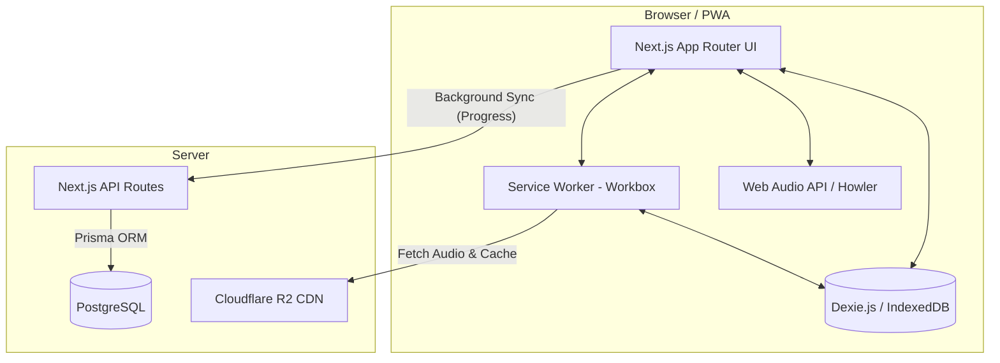

# System Architecture: DengarBain

DengarBain dibangun menggunakan paradigma **Offline-First**, memastikan santri di wilayah pondok pesantren dengan koneksi internet terbatas tetap bisa mengakses seluruh matan hadis dan fitur audio. 

Dokumen ini memetakan arsitektur sistem mulai dari tingkat aplikasi (PWA), penyimpanan lokal, hingga mekanisme sinkronisasi ke server pusat.

## 1. High-Level Architecture Diagram

## 2. Core Components

### 2.1. Frontend & UI (Next.js & Tailwind)
Aplikasi di-*render* secara statis (SSG) agar dapat dimuat seketika (instant-load). Kami menggunakan framework **Next.js** dan memanfaatkan **Radix UI** untuk komponen primitif tak berstilisasi yang 100% didukung WAI-ARIA.

### 2.2. Offline Core (Workbox)
Kami menggunakan Workbox untuk mengabstraksi Service Worker. Workbox diatur untuk melakukan:
- **Pre-caching**: Mengunduh seluruh berkas HTML, JS, dan CSS inti pada kunjungan pertama.
- **Cache-First Strategy for Audio**: Ketika pengguna menekan tombol "Play", Service Worker akan memeriksa *cache*. Jika audio MP3 sudah ada di *cache*, ia dimuat secara lokal. Jika belum, ia diunduh dari Cloudflare R2, diputar, dan sekaligus disimpan di *cache* untuk pemutaran tanpa internet di masa mendatang.

### 2.3. Local Database (Dexie.js)
Untuk melacak kemajuan hafalan (progres mendengarkan, daftar hadis favorit, atau rentang loop A-B) tanpa perlu koneksi internet, kami menyimpan *state* tersebut di **IndexedDB** melalui *wrapper* Dexie.js.

### 2.4. Frictionless Authentication (Device UUID)
Aplikasi didesain tanpa *login screen*. Saat PWA pertama kali dibuka, sistem men-*generate* **Device UUID** yang disimpan di *LocalStorage* dan *IndexedDB*. UUID ini bertindak sebagai "identitas anonim" dari perangkat pengguna.

### 2.5. Background Synchronization
Secara periodik, atau ketika PWA mendeteksi konektivitas internet pulih (`navigator.onLine`), sistem akan mengirim *batch update* progres dari Dexie.js ke backend melalui **Next.js API Routes**, yang selanjutnya disimpan ke **PostgreSQL** menggunakan **Prisma ORM**.
Ini memungkinkan pemantauan analitik penggunaan secara global tanpa melanggar privasi nama pengguna.

## 3. Audio Delivery Pipeline
Audio berformat MP3 (berkualitas tinggi namun terkompresi) disimpan di **Cloudflare R2**. Kami memilih arsitektur ini karena R2 menawarkan bebas biaya *egress*, sehingga ideal untuk mendistribusikan puluhan audio hadis ke banyak *client* secara bersamaan melalui edge node CDN Cloudflare.
