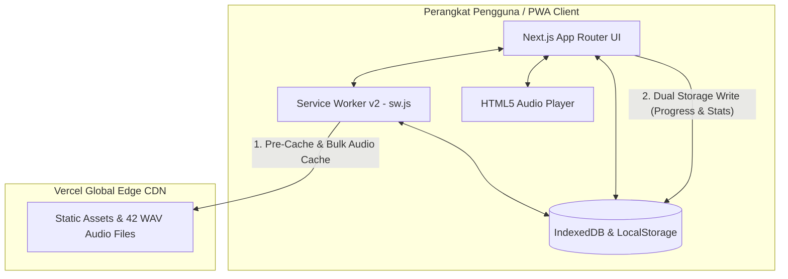

# System Architecture: DengarBain

DengarBain dibangun menggunakan paradigma **Offline-First**, memastikan santri di wilayah pondok pesantren dengan koneksi internet terbatas tetap bisa mengakses seluruh 42 matan hadis dan fitur audio secara mandiri. 

Dokumen ini memetakan arsitektur sistem mulai dari tingkat aplikasi (PWA), penyimpanan lokal (Dual Storage), hingga mekanisme pengiriman audio dan deployment.

## 1. High-Level Architecture Diagram

## 2. Core Components

### 2.1. Frontend & UI (Next.js 15 App Router & Vanilla CSS)
Aplikasi di-*render* secara statis (SSG / 57 Halaman Statis) agar dapat dimuat seketika (*instant-load*). Kami menggunakan framework **Next.js 15** dengan semantic HTML5 yang 100% didukung WAI-ARIA dan tema visual *High-Contrast* yang nyaman untuk pengguna *low-vision* maupun awas.

### 2.2. Offline Core (Service Worker v2)
Kami menggunakan Service Worker mandiri (`public/sw.js` dengan cache identifier `dengarbain-cache-v2`) yang diatur untuk melakukan:
- **Pre-caching**: Mengunduh seluruh rute halaman statis (`/`, `/hadis`, `/progres`, `/settings`, dll.) dan aset visual utama pada kunjungan pertama.
- **Cache-First Strategy for Audio**: Ketika pengguna memutar hadis atau menekan tombol **"Unduh Semua 42 Audio"**, Service Worker memeriksa dan menyimpan seluruh 42 file `.wav` ke *Cache Storage* lokal.
- **Stale-While-Revalidate**: Untuk berkas skrip Next.js, font Google, dan ikon SVG.

### 2.3. Dual Local Storage (IndexedDB + LocalStorage)
Untuk melacak kemajuan hafalan secara persisten tanpa koneksi internet dan tanpa akun:
- **IndexedDB**: Dikelola melalui helper `DengarBainDBHelper` (`lib/db.ts`) dengan 4 *Object Stores*: `hadisProgress`, `activities`, `settings`, dan `appState`.
- **LocalStorage**: Menyimpan salinan sinkron untuk pemuatan sinkron cepat saat inisialisasi awal.
- **Data yang Disimpan**: Status 42 hadis (`hafal`, `sedang`, `belum`), stempel waktu belajar, streak harian (hari berturut-turut), dan 15 riwayat aktivitas terbaru.

### 2.4. Frictionless Experience (Device UUID)
Aplikasi didesain tanpa *login screen*. Saat PWA pertama kali dibuka, sistem men-*generate* **Device UUID** anonim (`getOrCreateDeviceUUID()`) yang disimpan di *LocalStorage*. Ini menjaga privasi penuh pengguna tanpa mengumpulkan data pribadi (email/password).

### 2.5. Manajemen Penyimpanan & 1-Click Bulk Cache
Pengguna dapat memantau estimasi kapasitas memori peramban secara *real-time* via `navigator.storage.estimate()` di halaman `/settings/storage`, mengunduh seluruh 42 berkas audio dalam 1-klik, atau membersihkan cache audio kapan saja tanpa kehilangan catatan progres belajar di IndexedDB.

## 3. Audio Delivery Pipeline
- 42 File rekaman audio hadis berkualitas tinggi berformat `.wav` tersimpan di direktori `public/audio/hadis/`.
- Didukung kontrol kecepatan pemutaran (0.75x, 1.0x, 1.25x, 1.5x), tombol lompat +/- 10 detik, dan pengumuman *screen reader* dinamis (`aria-live="polite"`).

## 4. Production Deployment
- **Platform**: Vercel Global Edge Network
- **Production URL**: `https://production-eight-mu.vercel.app`
- **Branch Produksi**: `production`
